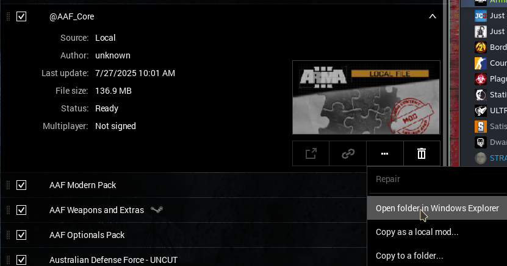
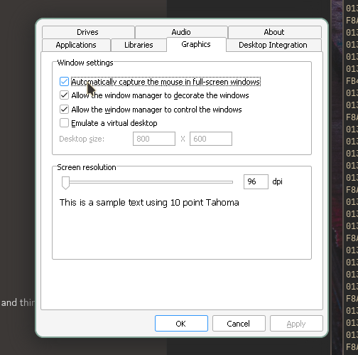

+++
title = "arma 3 on linux"
date = 2025-07-27
+++

# how to get arma 3 running on linux with radio mods
Are you only here for that question? Lucky you! This is incredibly simple!

I use nixos, but this should work everywhere unless you are using something more esoteric than nix.

First, obviously install and run arma, and also download the teamspeak 3 (64 bit) installer then run arma to the launcher. Now you will need to be subscribed to a mod. Now click on the mod, click the 3 dots, and click 'open in windows explorer'.

Now, run the teamspeak 3 launcher and **remember to uncheck the overwolf thing**, I do not know if it actually will break anything, but it probably will and you do not want overwolf anyway. Close teamspeak. Now you should just be able to launch the game, and for ACERE2 at least, it will install the plugin automatically. I am unsure of what will happen if you use something else, but you can just follow it's guide for installing the plugin. This is it, transfer your profiles over (in the documents folder for windows, under `Arma 3 - Other Profiles`) and everything should work.

## bonus performance things
In the arma 3 launcher, under parameters, turn on the following:
- Basic
  - Show static background in menu: true
  - Skip logos at startup: true
  - Force window mode: true
- Advanced
  - Extra Threads: true
    - File operations: true
    - Texture loading: true
    - Geometry loading: true
  - No logs: true (this is probably really minimal on performance increase, so maybe don't bother because you may need the logs)

## bonus troubleshooting step!!
The game may not lock your mouse to the window, if this is the case run protontricks, select arma, select the default wine prefix, and run `winecfg`. In winecfg enable "automatically capture the mouse in full-screen windows". This should hopefully fix it for you, it did for me.

The reason I do not use gamescope, is that this method requires running the launcher, the game, teamspeak and wine explorer. Gamescope simply cannot handle this.

## bonus extra resources!

# how to run arma on linux, part 2: how not to trouble shoot an issue on nixos (or anywhere!)
If you are only here to get arma running, this is not more about how to get arma running, if you have problems please contact me somewhere and I will try my best to help.

This is not any form of guide beyond lessons learned doing this.

This saga started during a operation with the unit I am in, [BlueMaxima](<https://bluemaxima.org/>), creator of [Flashpoint](<https://flashpointarchive.org/>), mentioned that he was having windowing issues. After realising he was on linux I pointed him to gamescope which worked for him as he is using a script and `arma-3-unix-launcher` to launch the game.

This made me realise that there are people that have gotten arma working, and play with it, and that me giving up about a year ago was because I was missing something, not because it was impossible. After the mission I ask him how to do it, and he gives me a very detailed step by step, and some resources:

> - Force Proton 9 in the compatibility menu for Arma 3, install Arma 3, run it once and try to get to the main menu past the launcher (the regular launcher can be iffy on Proton)
> - Install arma3-linux-launcher-git (I'm on an Arch-based distro so it's on yay), it does have an App Image as well https://github.com/muttleyxd/arma3-unix-launcher/releases
> - Get the Arma 3 Helper script (Arma3Helper.sh) and put it somewhere easy to get to like a folder in your home directory https://github.com/ninelore/armaonlinux
> - Download TeamSpeak 3's installer, rename it to TS3.exe, put it in the folder with Arma3Helper.sh
> - Open a terminal in Arma3Helper.sh's folder and run "./Arma3Helper.sh winetricks Arma" no quotes
> - Then run "./Arma3Helper.sh install TS3.exe" no quotes, select Install for All Users but don't change any other settings
> - Copy all the AAF related mod folders starting with @ symbols into Arma 3's directory (you can use the Settings cog in Arma 3's game page - Manage - Browse local files, put them all in there)
> - Open Arma 3 Unix Launcher (if you've installed it correctly Steam will think you're playing Arma 3)
> - At the bottom of Arma 3 Unix Launcher, click the Add button in the Custom mods row, add every AAF mod's directory by going to its specific directory, you will need to do this a few times for all the mods, if you select the correct folder it should show up in the mod list as a custom mod
> - Open one of the HTML presets from the missions channel, it will pop up an error about missing local mods and possibly workshop mods, any missing workshop mods will give you a prompt to subscribe to them, if it does, close Arma 3 Unix Launcher and wait for the workshop mods to update via Steam
> - Scroll down and tick all the mods that the launcher complained about by name, they'll all be custom mods in the type column, you will need to do this every time you change preset, don't rely on saving through the mod manager because the preset ANZIF-side might change
 > - Launch Arma 3 via the start button
> - Run Arma3Helper.sh after Arma is loaded (I'd recommend making it executable by changing its properties so that you can just double-click it)
> - Check your plugins menu in TeamSpeak for ACRE, it should install automatically if you've done it right
> - Disable the gamepad plugin, it can cause issues if you have a controller plugged in

> At this point, running Arma 3 is loading up the Arma 3 Unix Launcher, grabbing the preset and making sure you tick the right mods, starting Arma 3, and when you're at Arma 3's menu, running Arma3Helper.sh to boot up TeamSpeak
> 
> Known issues:
> Your Windows key will bring up your start menu, you'll want to remap your ace interact keys (mapped mine to TAB, just need to get over the muscle memory)
> Multi-monitor setups might suck, you can do something like edit your monitor arrangement to be corner-to-corner, haven't figured out how to make gamescope work via the unix launcher

## part 1 of part 2: do what you are told
Instead of simply following the helpful guide, I decide, lets make it slightly different!!! Instead of just downloading the script and running it, I [package it for nix](<https://github.com/skoove/arma3helper-flake>) (do not use it, it probably will not work). Instead of using proton 8.0, I try and use proton GE, and on and on. I still mostly followed it and in the end, i did do everything in the guide.. up until installing teamspeak 3 because that never worked. But from the start I should ahve done what I was told to do anyway, because I still would have saved time, if it had of worked for me.

## part 2 of part 2: read the freaking errors properly
I saw a common error whenever trying to get anywhere, something something cant find FreeType library. TLDR this did not matter at all, and the only reason I cared is because it said it alot, so I spend a day trying to fix that (I never fix it). While doing this, I ignore the big error below it, `/lib/ld-linux.so.2` is missing.

## part 3 of part 2: know your tools
I like to think I am starting to get the hang of nixos. Even if this is true, I am stupid. I try for a day to install random wine packages to get the file, this obviously does not work, as anyone who uses nix would know. I try to copy the file from another package (specificly steam!) into `/lib/`. This is extra stupid, by now I seriously should have realised that I was being insanely dumb. Often, when running programs in nix, you need to wrap them in a horrible trap to make them think they are in a normal linux computer and not nixos, I knew this. Steam specificly from what I understand needs a bit of convincing, and I presume this extends to steam things like Proton, what the real solution would be (and was!) is to run proton and the teamspeak installer in the same environment that nix runs steam is.

## part 4 of part 2: joy
The solution was exactly what I said in the install guide, run the installer from a running instance of the prefix. I am fairly sure I can actually get those scripts to work if I wrap them correctly, but I cannot be bothered, maybe someday I will be bored and do it, but not currently.

Even though I wasted alot of time, seeing everything just work after it all clicked for me felt great, and reminded me of why I put myself through this, I learn more every time, and I get to maybe help at least one person in the future.

